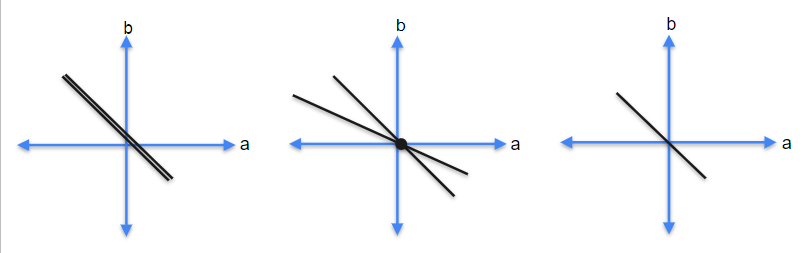
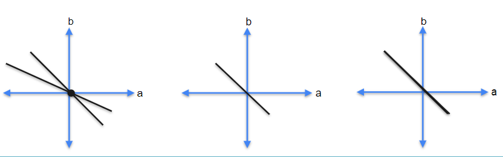
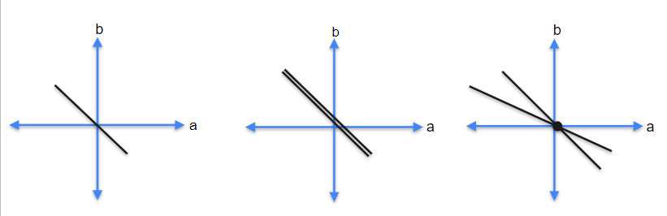
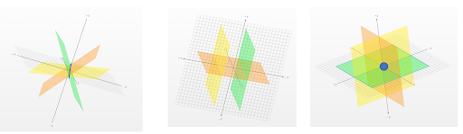
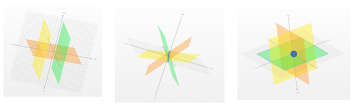
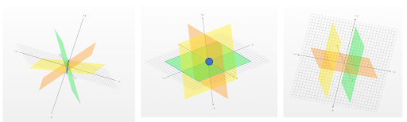
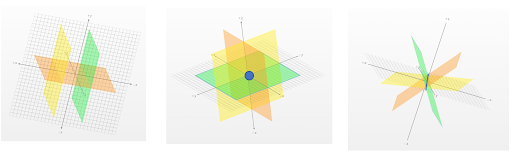

**1.** On your next mission, while collecting rock samples, you observe a new crystal structure containing carbon, which could be key to life! You utilize the third spacecraft, Ingenuity, and meticulously collect enough rock samples to distribute within the weight limits of each spacecraft.

You place 2 basalt samples, 1 meteorite, and 5 crystal rock samples into the Perseverance rover, which all weigh 20 grams. 

You then distribute 1 basalt, 2 meteorites, and 1 crystal into the Curiosity rover, with a weight of 10 grams in total. 

Lastly, you place 2 basalt samples, 1 meteorite, and 3 crystals to Ingenuity, which together weigh 15 grams. Each rock sample is represented with variables b for basalt, m for meteorite, and c for crystal structures. 

**Which of the following systems of equations represents the correct information in the above system of sentences?**
- [ ] (A)

$$\begin{cases} 2b + m + 5 = 20 \cr b + 2m + c = 10 \end{cases}$$
- [ ] (B)

$$\begin{cases} 2b + m + 5c = 100 \cr b + 2m + c = 23 \cr 2b + m + 3c = 35 \end{cases}$$
- [ ] (C)

$$\begin{cases} m + 2b + 5 = 20 \cr 2b + m + c = 10 \cr b + 2m + 3c = 15 \end{cases}$$
- [x] (D)

$$\begin{cases} 2b + m + 5c = 20 \cr b + 2m + c = 10 \cr 2b + m + 3c = 15 \end{cases}$$

**2. Which of the following matrices represents the system of equations?**
- [ ] (A)

$$\begin{bmatrix} 2 & 1 & 5 & 20 \cr 1 & 2 & 1 & 10 \cr 2 & 1 & 3 & 15 \end{bmatrix}$$
- [ ] (B)

$$\begin{bmatrix} 2 & 1 & 0 \cr 1 & 2 & 0 \cr 2 & 1 & 0 \end{bmatrix}$$
- [x] (C)

$$\begin{bmatrix} 2 & 1 & 5 \cr 1 & 2 & 1 \cr 2 & 1 & 3 \end{bmatrix}$$
- [ ] (D)

$$\begin{bmatrix} 2 & 1 \cr 1 & 2 \cr 2 & 1 \end{bmatrix}$$

**3. Calculate the determinant of the matrix that represents the system of equations above. Is the matrix singular or non-singular?**

Hint: To find the determinant, apply the method described in the lecture The determinant (3x3)
- [ ] 6, Singular
- [x] -6, Non-singular
- [ ] -6, Singular
- [ ] 0, Singular

**4. Determine if the matrix found in Question 2 has linearly dependent or independent rows.**
- [x] Linearly independent.
- [ ] It cannot be determined.
- [ ] Linearly dependent.

**5. How much does each rock sample weigh?**

Solve the system of equations for each of the spacecraft.
- [ ] basalt = 6g, meteorite = 1g, crystal = 3g
- [ ] basalt = 2.5g, meteorite = 2.5g, crystal = 5.5g
- [ ] basalt = 1.5g, meteorite = 3.5g, crystal = 2.5g
- [x] each rock sample = 2.5g

**6.** You are given the following matrix with the values for rock samples weighs in the Perseverance and Curiosity rovers, consisting of the first and second row respectively. 

**For which values in Ingenuity does the matrix have linearly dependent rows?**

$$\begin{bmatrix} 2 & 1 & 5 \cr 1 & 2 & 1 \cr \color{red}\mathbf{x} & \color{red}\mathbf{y} & \color{red}\mathbf{z} \end{bmatrix}$$

(Notation for weight samples: x - basalt, y - meteorite, z- crystal.)
- [x] x = 3, y = 3, z = 6
- [ ] x = 1, y = 3, z = 3
- [ ] x = 1, y = 2, z = 3

**7.** In an effort to optimize the weight distribution, your colleague suggests you split the rocks into the represented matrix. 

$$\begin{bmatrix} 1 & 2 & 3 \cr 0 & 2 & 2 \cr 1 & 4 & 5 \end{bmatrix}$$

**Calculate the determinant in the system of equations and determine if the matrix is singular or non-singular.**
- [ ] 5, Non-singular
- [x] 0, Singular
- [ ] 0, Non-singular

**8. Select which of the following are true for non-singular matrices.**
- [x] In a non-singular matrix, rows are linearly independent.
- [ ] In a non-singular matrix a row can be a multiple of the other one.
- [ ] In a non-singular matrix, rows are linearly dependent.
- [x] In a non-singular matrix there is only a unique solution for the represented system of equations.

**9. To train your AI assistant to classify systems of equations, you’re now asked to select the correct sequence of graphs that represents a system of linear equations with:**

**1. zero solutions, 2. just one solution, 3. infinitely many solutions.**
- [x] (A)

- [ ] (B)

- [ ] (C)

**10. Select the correct sequence of graphs that shows:**

**1. zero solutions, 2. just one solution, 3. infinitely many solutions.**
- [ ] (A)

- [ ] (B)

- [ ] (C)

- [x] (D)

