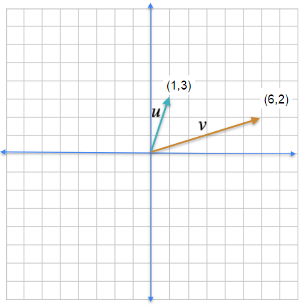
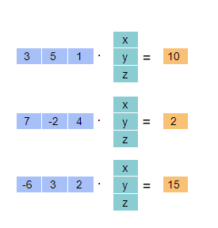

**1. Which of the following options is true for a vector?**
- [ ] A vector has only a magnitude.
- [ ] A vector has a shape and weight. 
- [x] A vector has a magnitude and direction.
- [ ] A vector has only direction.

**2.**

**Compute the sum of the vectors** $\vec{u}$ and $\vec{v}$. Hint: The sum vector is the diagonal in a parallelogram formed by the two vectors, $\vec{u} = \left( 1,3 \right)$ and $\vec{v} = \left( 6,2 \right)$.
- [ ] $\vec{u} + \vec{v} = \left( 6,3 \right)$
- [ ] $\vec{u} + \vec{v} = 20$
- [ ] $\vec{u} + \vec{v} = 3$
- [x] $\vec{u} + \vec{v} = \left( 7,5 \right)$

**3. Compute the difference of the vectors $\vec{u}$ and $\vec{v}$.**
- [ ] $\vec{u} - \vec{v} = \left( -1,5 \right)$
- [x] $\vec{u} - \vec{v} = \left( -5,1 \right)$
- [ ] $\vec{u} - \vec{v} = 3$
- [ ] $\vec{u} - \vec{v} = \left( 5,1 \right)$

**4. Calculate the dot product of the given vectors $\vec{a} \cdot \vec{b}$ and select the correct answer.**

$$\vec{a} = \begin{bmatrix} -1 \cr 5 \cr 2 \end{bmatrix}, \vec{b} = \begin{bmatrix} -3 \cr 6 \cr -4 \end{bmatrix}$$

- [ ] (A)

$$\begin{bmatrix} 1 \cr 0 \cr 1 \end{bmatrix}$$
- [ ] (B)

$$\begin{bmatrix} -3 \cr 30 \cr -8 \end{bmatrix}$$
- [ ] (C)

$$30$$
- [x] (D)

$$25$$

**5. Which of the following is true, if $\vec{a} \cdot \vec{a} = 0$ and $\vec{a} \cdot \vec{b} = 0$ ?**
- [ ] $\vec{a} = 0, \vec{b} = 0$
- [ ] $\vec{a} \cdot \vec{a} = 1$
- [x] $\vec{a} = 0, \vec{b} =$ any vector
- [ ] $\vec{a} \mathrel{{=} \llap{/}} 0, \vec{b} = 0$ 

**6. Which of the following is the correct representative system of equation for the given dot product:**

The image above represents the following:

$$\begin{bmatrix} 3 & 5 & 1 \end{bmatrix} \cdot \begin{bmatrix} x \cr y \cr z \end{bmatrix} = 10$$

$$\begin{bmatrix} 7 & -2 & 4 \end{bmatrix} \cdot \begin{bmatrix} x \cr y \cr z \end{bmatrix} = 2$$

$$\begin{bmatrix} -6 & 3 & 2 \end{bmatrix} \cdot \begin{bmatrix} x \cr y \cr z \end{bmatrix} = 15$$

- [ ] (A)

$$\begin{cases} 3x + 5y + z = 2 \cr 7x - 2y + 4z = 1 \cr -6x + 3y + 2z = 20 \end{cases}$$
- [x] (B)

$$\begin{cases} 3x + 5y + z = 10 \cr 7x - 2y + 4z = 2 \cr -6x + 3y + 2z = 15 \end{cases}$$
- [ ] (C)

$$\begin{cases} 3x - 2y + 4z = 10 \cr 7x - 2y + 4z = 2 \cr -6x + 3y + 2z = 15 \end{cases}$$
