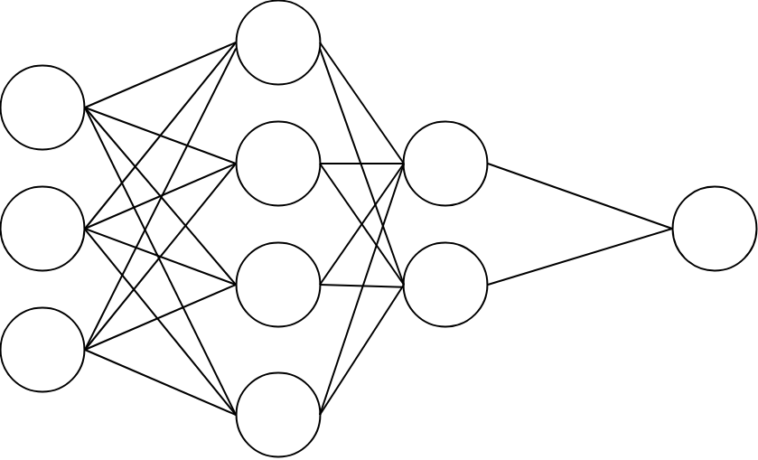

<**Neural Networks for whisker patterns recognition in lion tribes**>

**You’re a scientist on a mission** – develop a non-invasive tracking method for wild species. To assist your team in distinguishing lions that are often hard to identify among their tribes due to their similar markings, you turn to machine intelligence using your knowledge of matrices and vectors to build a Deep Learning model that identifies lions simply from their whisker patterns. This will help researchers in estimating the number of endangered species on the planet and study behavioral patterns throughout lion habitats. 

Your model has an input in the form of pixels (numerical data) from the images that your camera captures of the lions’ faces (**weight matrix $W$**), which is bounded on the whiskers area, then fed into the model (**vector shape $\vec{b}$**) to output a **vector $\vec{y}$ as the result** of an accurate identification of the lion from the tribe. As you'll see, even the most complex neural networks are in essence built out of simple building blocks that consist of matrix multiplications!

**1.** We'll start with a weight matrix $W$ that represents your input data with features.

**What is the determinant of matrix $W$?**

$$W = \begin{bmatrix} 1 & 2 & -1 \cr 1 & 0 & 1 \cr 0 & 1 & 0 \end{bmatrix}$$

- [ ] 1/2
- [ ] 0
- [x] -2
- [ ] -1

**2. Calculate the inverse matrix $W^{-1}$ of the provided matrix $W$ in Q1.**

- [ ] (A) The inverse matrix cannot be determined.

- [ ] (B)

$$\begin{bmatrix} \frac 14 & \frac 14 & -2 \cr 0 & 0 & 1 \cr -\frac 14 & \frac 25 & 1 \end{bmatrix}$$
- [ ] (C)

$$\begin{bmatrix} 1 & 1 & 0 \cr 2 & 0 & 1 \cr -1 & 1 & 0 \end{bmatrix}$$
- [ ] (D)

$$\begin{bmatrix} -1 & -2 & 1 \cr -1 & 0 & -1 \cr 0 & -1 & 0 \end{bmatrix}$$
- [x] (E)

$$\begin{bmatrix} \frac 12 & \frac 12 & -1 \cr 0 & 0 & 1 \cr -\frac 12 & \frac 12 & 1 \end{bmatrix}$$

**3. What would the output be when you multiply the inverse matrix $W^{-1}$ that you selected from the problem above with a 3-dimensional identity matrix?**

$$ID = \begin{bmatrix} 1 & 0 & 0 \cr 0 & 1 & 0 \cr 0 & 0 & 1 \end{bmatrix}$$

- [ ] $W$
- [ ] $W \cdot W^{-1}$
- [ ] $ID$ (3x3 Identity matrix)
- [x] $W^{-1}$

**4. Is the rank of the 3x3 Identity matrix (ID) singular or non-singular?**

$$ID = \begin{bmatrix} 1 & 0 & 0 \cr 0 & 1 & 0 \cr 0 & 0 & 1 \end{bmatrix}$$

Hint: if the matrix is full rank then the inverse exists. Remember from videos, when the inverse exists, is the matrix singular or non-singular?

- [x] Non-singular
- [ ] Singular

**5. You're now introduced to a shape vector $\vec{b}$ which you use to multiply the weight matrix $W$.**

$$\vec{b} = \begin{bmatrix} 5 \cr -2 \cr 0 \end{bmatrix}, W = \begin{bmatrix} 1 & 2 & -1 \cr 1 & 0 & 1 \cr 0 & 1 & 0 \end{bmatrix}$$

**What is the output result $\vec{y}$? Is this linear transformation singular or non-singular?**
- [ ] It cannot be determined.

- [x] Non-singular Linear transformation

$$\vec{y} = \begin{bmatrix} 1 \cr 5 \cr -2 \end{bmatrix}$$
- [ ] Singular Linear Transformation

$$\vec{y} = \begin{bmatrix} 1 \cr -2 \cr 5 \end{bmatrix}$$

**6. True or False:  The determinant of a product of matrices is always the product of the determinants of the matrices.**
- [x] True
- [ ] False

**7. As part of your calculations, you extract the first and the third column of features from the matrix $Z$.**

$$Z = \begin{bmatrix} 3 & 5 & 2 \cr 1 & 2 & 2 \cr -7 & 1 & 0 \end{bmatrix}$$

**Considering them as vectors, their dot product is:**

Hint: You may use pen and paper for this problem, which asks for the dot product of two vectors from the matrix.

- [ ] (A)

$$\begin{bmatrix} 6 \cr 2 \cr 0 \end{bmatrix}$$
- [x] (B)

$$8$$
- [ ] (C)

$$-8$$
- [ ] (D)

$$\begin{bmatrix} 0 \cr 6 \cr 2 \end{bmatrix}$$

**8.** To train your algorithm well, you need more data. Sometimes a way to get more data is to transform (augment) the data that you already have. One way of augmenting the data is applying linear transformations like rotation or shear, which can easily be done by matrix multiplication.

**To augment your input data, you multiply matrices $A$ and $B$.**

$$A = \begin{bmatrix} 5 & 2 & 3 \cr -1 & -3 & 2 \cr 0 & 1 & -1 \end{bmatrix}$$

$$B = \begin{bmatrix} 1 & 0 & -4 \cr 2 & 1 & 0 \cr 8 & -1 & 0 \end{bmatrix}$$

**Select the output for $A \cdot B$. You may use pen and paper to multiply the matrices.**

- [x] (A)

$$A \cdot B = \begin{bmatrix} 33 & -1 & -20 \cr 9 & -5 & 4 \cr -6 & 2 & 0 \end{bmatrix}$$
- [ ] (B)

$$A \cdot B = \begin{bmatrix} 9 & -5 & 4 \cr -6 & 2 & 0 \cr 33 & -1 & -20 \end{bmatrix}$$
- [ ] (C) $A \cdot B$ cannot be computed.

**9. Calculate the determinant of the inverse of the output matrix $A \cdot B$ that you selected in Q8.**

$$det \left( A \cdot B \right)^{-1} = 1/det \left( A \cdot B \right)$$

Hint: the determinant of an inverse is the inverse of the determinant.
- [ ] $det \left( A \cdot B \right)^{-1} = 1$
- [ ] $det \left( A \cdot B \right)^{-1} = 0$
- [ ] $det \left( A \cdot B \right)$ cannot be computed.
- [x] $det \left( A \cdot B \right)^{-1}$ cannot be computed.

**10. Which of the following statements are correct? Select all that apply:**
- [x] Singular matrices are non-invertible.
- [x] The determinant of an inverse matrix is the inverse of the determinant of the matrix.
- [ ] Non-singular matrices are non-invertible.
