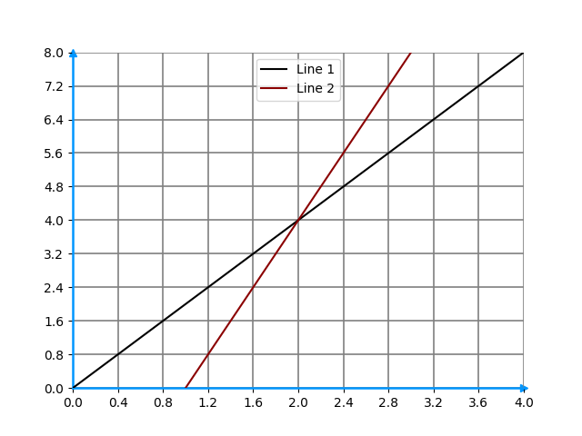
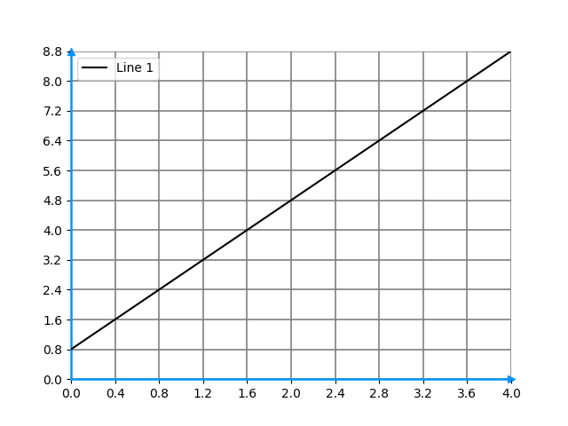
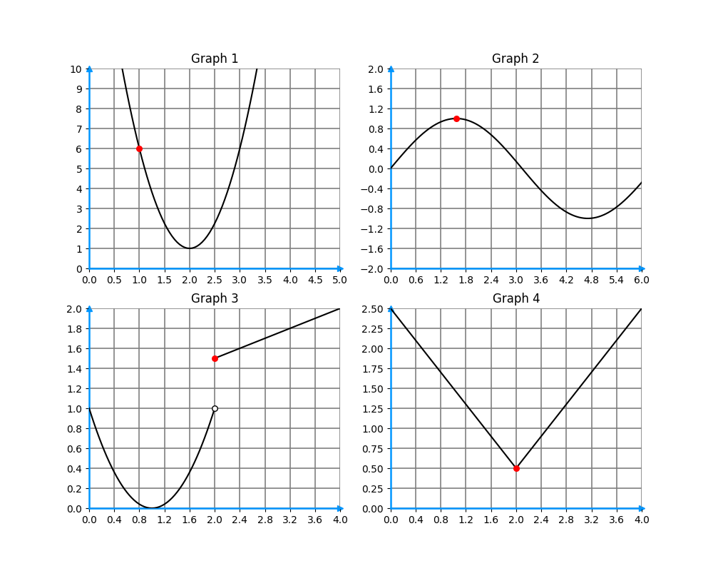

**1.** Consider the following lines.

What can be said about their slopes at their intersection?
- [ ] Slope(Line 1) > Slope(Line 2).
- [x] Slope(Line 1) < Slope(Line 2).
- [ ] Slope(Line 1) = Slope(Line 2).
- [ ] It is impossible to infer anything with the given information.

**2.** Given the following graph, what is the slope of the line? You can pick any two points to calculate the slope.

Answer: 2

**3.** Consider the graphs below

What can be said about the curve’s slopes at the red point, which we will call P1, P2, P3 and P4, corresponding to the red points in the graphs 1, 2, 3 and 4, respectively?
- [ ] Slope(P1) > 0, Slope(P2) < 0, Slope(P3) does not exist, Slope(P4) = 0.
- [ ] Slope(P1) < 0, Slope(P2) = 0, Slope(P3) > 0, Slope(P4) does not exist.
- [x] Slope(P1) < 0, Slope(P2) = 0, Slope(P3) does not exist, Slope(P4) does not exist.
- [ ] Slope(P1) < 0, Slope(P2) = 0, Slope(P3) does not exist, Slope(P4) > 0.

**4.** Let $y_1 = ax + b$ and $y_2 = cx + d$, where $a, b, c, d \in \Bbb R$. Check all the sentences that are true.
- [x] The slope of $y_1$ is $a$.
- [ ] The slope of $y_1$ is $- \frac ab$.
- [x] If $a > c$ then the slope of $y_1$ is greater than the slope of $y_2$.
- [x] The slope of $y_1$ does not depend on $b$.

**5.** Which of the following sentences are true (check all that apply)?
- [ ] If the slope of a function is constant, then the function is constant.
- [ ] If the slope of a function is always positive, then the function is always positive.
- [ ] Let $f, g$ be real functions. If $f'(x) > g'(x)$ then $f(x) > g(x)$.
- [x] Let $f$ be a real function. If $f'(x) > 0$ for every $x$ in $\Bbb R$, then $f$ is increasing.
