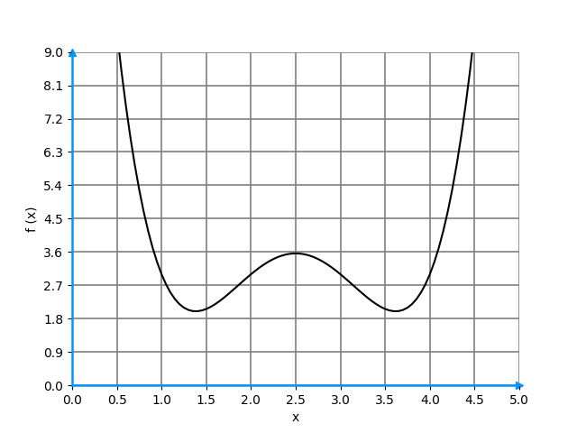
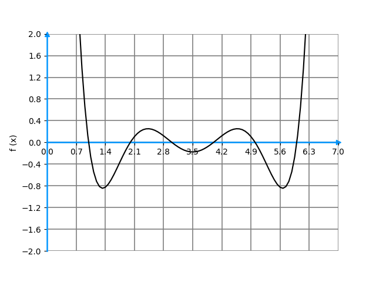

**1.** Which of the following represents the derivative of a function $f(x)$ (check all that apply)?
- [ ] $F(x)$
- [x] $f'(x)$
- [ ] $f'(x^2)$
- [x] $\frac{df(x)}{dx}$
- [ ] $\frac{f(x)}{df(x)}$

**2.** Consider the graph of the following function $f(x)$.

Regarding **its derivative**, $f'(x)$, where $x \in [0, 5]$: (check all that apply)
- [ ] $f'(x)$ is always positive.
- [x] $f'(x)$ has three zeros, i.e., $f'(x) = 0$ three times.
- [ ] $f'(x)$ has two zeros, i.e., $f'(x) = 0$ twice.
- [x] $f'(1) < 0$.
- [x] $f'(4) > 0$.

**3.** What is the derivative of $3x^3 - 2x + 1$?
- [ ] $3x^2 - 2$
- [ ] $9x^2 - 2 + 1$
- [x] $9x^2 - 2$
- [ ] $9x^3 - 1$

**4.** Suppose you have a game where you toss a coin 20 times and win if you get, in this exact order, 16 heads and 4 tails. However, in this game, you can choose any coin and toss it 20 times.

Which of the following functions you need to maximize in order to find the best coin for this game? Consider $p$ being the probability of a given coin being heads.
- [ ] $16 \log (p) + 4 \log (p)$
- [x] $16 \log (p) + 4 \log (1 - p)$
- [ ] $4 \log (p) + 16 \log (1 - p)$
- [ ] $4 \log (1 - p) + 16 \log (1 - p)$

**5.** Let $f(x)$ be a real valued function with the following graph. In the interval $[0, 7]$, how many zeros has its derivative $f'(x)$?

Answer: 5

**6.** If $f(x)$ and $g(x)$ are differentiable functions, then the derivative of $f(x)g(x)$ is given by:
- [x] $f'(x) \cdot g(x) + g'(x) \cdot f(x)$
- [ ] $f'(x) \cdot g'(x) + f(x) \cdot g(x)$
- [ ] $f'(x) \cdot g(x) - f(x) \cdot g'(x)$
- [ ] $f'(x) \cdot g'(x)$

**7.** The **rate of change** of $f(x) = x^2 + 3$ at $x = 6$ is:

Answer: 12

**8.** Let $f(x)$ be a **positive** real function and $g(x) = \log f(x)$.

Check all that apply.
- [ ] $\frac{df(x)}{dx} = \frac{dg(x)}{dx}$
- [x] If $x_{max}$ is a point where $f(x_{max})$ is a local maximum, then $g(x_{max})$ is also a local **maximum**. 
- [ ] If $x_{max}$ is a point where $f(x_{max})$ is a local maximum, then $g(x_{max})$ is also a local **minimum**.
- [ ] If $f(x)$ is differentiable, then so is $g(x)$.

**9.** Using the **chain rule**,the derivative of $e^{-x}$ is:
- [ ] $e^{-x}$
- [ ] $-e^x$
- [x] $-e^{-x}$
- [ ] $e^x$
