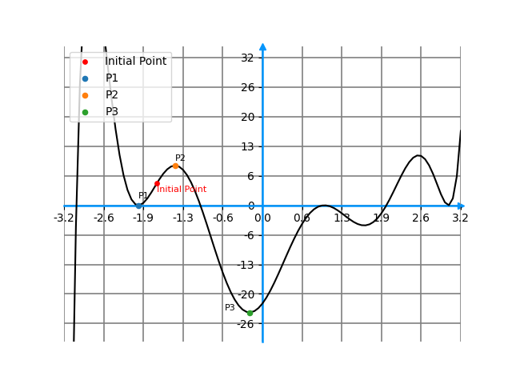

**1.** About the Gradient Descent method, choose all that are true:
- [ ] It always converges to a local minimum.
- [x] The result may vary depending on the initial point.
- [ ] If it converges, then it converges to a global minimum.
- [x] It only works for differentiable functions.

**2.** Given the Initial Point on the following graph, to which point will the Gradient Descent method converge?

- [x] P1.
- [ ] P2.
- [ ] P3.
- [ ] It won’t converge.

**3.** Given that $f(x, y) = x^3y^2 + 3y^3$, find its derivative with respect to $y$, i.e., find $\frac{\partial f}{\partial y}$.

Note: Please use * to indicate the product in the answer. So, if we wrote the entire function $f$ as an answer, it would be x^3 * y^2 + 3 * y^3.

Answer: $2x^3y + 9y^2$ (2 * x^3 * y + 9 * y^2)

**4.** Let $f(x, y) = 2x^2 + 3y^2 - 2xy - 10x$, the minimum value of $f(x, y)$ is
- [x] -15
- [ ] 3
- [ ] 1

**5.** What are the parameters that the Gradient Descent algorithm has? (check all that apply)
- [x] Initial point
- [ ] Final point
- [x] Learning rate
- [x] Number of iterations

**6.** Let $f(x, y)$ and $\nabla f(x, y)$ and let the initial point $x_0 = (0, 1)$.

$$f(x, y) = x^2 + y^2 - 6x, \nabla f(x, y) = \begin{bmatrix} 2x - 6 \cr 2y \end{bmatrix}$$

Performing the gradient descent algorithm with learning rate = 0.1, the first iteration will lead us the point $x_1$ which is:
- [x] $x_1 = (0.6, 0.8)$
- [ ] $x_1 = (-6, 2)$
- [ ] $x_1 = (6, -1)$
- [ ] $x_1 = (0, 1)$
