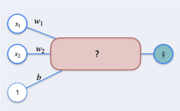
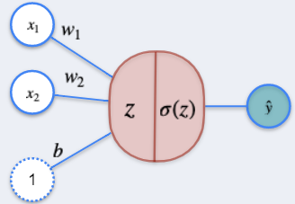
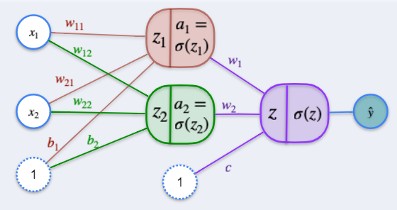

**1.** Given the Single Layer Perceptron described in the lectures:

What should be replaced in the question mark?
- [ ] $w_1w_2 + x_1x_2 + b$
- [ ] $w_1x_1 + w_2x_2 + b_1 + b_2$
- [x] $w_1x_1 + w_2x_2 + b$
- [ ] $w_1x_2 + w_2x_1 + b$

**2.** For a Regression using a Single Layer Perceptron, select all that apply:
- [ ] The Loss Function used is $L \left( y, \hat{y} \right) = -y \ln \left( \hat{y} \right) - \left( 1 - y \right) \ln \left( 1 - \hat{y} \right)$.
- [x] The Loss Function used is $L \left( y, \hat{y} \right) = \frac{1}{2} \left( y - \hat{y} \right)^2$.
- [x] To minimize the Loss Function, we consider $L \left( y, \hat{y} \right)$ as a function of $w_1, w_2$ and $b$.
- [ ] To minimize the Loss Function, we consider $L \left( y, \hat{y} \right)$ as a function of $x_1$ and $x_2$.

**3.** Consider the problem of Classification using a Single Layer Perceptron as discussed in the lectures.

In the figure above, $z$ and $\sigma \left( z \right)$ are, respectively:
- [ ] $z = w_1x_1 + w_2x_2 + b$ and $\sigma \left( z \right) = \frac{1}{2} \left( z - \hat{z} \right)^2$
- [ ] $z = \frac{1}{1 + e^{-z}}$ and $\sigma \left( z \right) = w_1x_1 + w_2x_2 + b$
- [ ] $z = x_1 + x_2 + b$ and $\sigma \left( z \right) = \frac{1}{2} \left( z - \hat{z} \right)^2$
- [x] $z = w_1x_1 + w_2x_2 + b$ and $\sigma \left( z \right) = \frac{1}{1 + e^{-z}}$

**4.** In the 2, 2, 1 Neural Network described below

How many parameters must be tuned to minimize the Loss Function?
- [ ] $2$
- [ ] $3$
- [ ] $6$
- [x] $9$

**5.** About Backpropagation, check all that apply:
- [ ] It is a way to obtain the input values for a given output of a neural network.
- [x] It is a method to update the parameters of a neural network.
- [ ] It is the same as gradient descent.
- [x] It is a method that starts in the output layer and finishes in the input layer.
