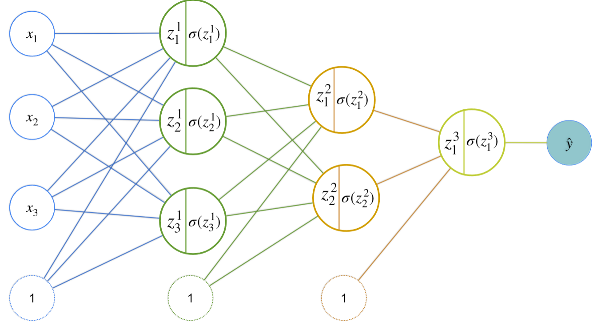

**1.** Using Newton’s method, find an approximation recursive formula for $\sqrt{2}$.

To help you, remember that $\sqrt{2}$ is the positive solution for $x^2 - 2$, so you can use $f \left( x \right) = x^2 - 2$.
- [ ] $x_{k+1} = x_{k} - \frac{2x_{k}}{x_{k}^{2} - 2}$
- [ ] $x_{k+1} = \frac{x_{k}^{2} - 2}{2x_{k}}$
- [ ] $x_{k+1} = \frac{2x_{k}}{x_{k}^{2} - 2}$
- [x] $x_{k+1} = x_{k} - \frac{x_{k}^{2} - 2}{2x_{k}}$

**2.** Regarding the previous question, suppose you don’t know any approximation for $\sqrt{2}$ and only that it is a positive real number such that $x^{2} = 2$. Which value from the list below will result in the fastest convergence?
- [ ] $4$
- [ ] $3$
- [x] $2$
- [ ] The initial value does not impact in the Newton’s method convergence.

**3.** Let’s continue investigating the method we are developing to compute the $\sqrt{2}$. Remember that we used the fact that $\sqrt{2}$ is one of the roots of $x^{2} - 2$. What would happen if we have chosen a negative value as initial point?
- [ ] The algorithm would not converge.
- [ ] The algorithm would converge to $\sqrt{2}$.
- [x] The algorithm would converge to the negative root of $x^{2} - 2$.
- [ ] The algorithm would converge to $0$.

**4.** Did you know that it is possible to calculate the reciprocal of any numberwithout performing division? (The reciprocal of a non-zero real number $a$ is $\frac{1}{a}$).

Setting a non-zero real number $a$, use the function $f \left( x \right) = a - \frac{1}{x} = a - x^{-1}$ to find such formula.

This method was in fact used in older IBM computers to implement division in hardware!

So, the iteration formula to find the reciprocal of $a$, in this case, is:
- [x] $x_{k+1} = 2x_{k} - ax_{k}^{2}$
- [ ] $x_{k+1} = 2x_{k} + ax_{k}^{2}$
- [ ] $x_{k+1} = 2x_{k} - x_{k}^{2}$
- [ ] $x_{k+1} = x_{k} - ax_{k}^{2}$

**5.** Suppose we want to find the minimum value (suppose we already know that the minimum exists and is unique) of $x \log{\left( x \right)}$ where $x \in \left( 0, +\infty \right)$. Using Newton’s method, what recursion formula we must use?

Hint: $f \left( x \right) = x \log{\left( x \right)}$, $f^{\prime} \left( x \right) = \log{\left( x \right)} + 1$ and $f^{\prime \prime} \left( x \right) = \frac{1}{x}$
- [ ] $x_{k+1} = x_{k} - \frac{x_{k} \log{\left( x_{k} \right)}}{\log{\left( x_{k} \right)} + 1}$
- [ ] $x_{k+1} = x_{k} - x_{k}^{2} \log{\left( x_{k} \right)}$
- [ ] $x_{k+1} = x_{k} - \log{\left( x_{k} \right)}$
- [x] $x_{k+1} = x_{k} - x_{k} \left( \log{\left( x_{k} \right)} + 1 \right)$

**6.** Regarding the Second Derivative Test to decide whether a point with $f^{\prime} \left( x \right) = 0$ is a local minimum or local maximum, check all that apply.
- [ ] If $f^{\prime \prime} \left( x \right) \lt 0$ then $x$ is a local minimum.
- [x] If $f^{\prime \prime} \left( x \right) \gt 0$ then $x$ is a local minimum.
- [ ] If $f^{\prime \prime} \left( x \right) = 0$ then $x$ is an inflection point.
- [x] If $f^{\prime \prime} \left( x \right) = 0$ then the test is inconclusive.

**7.** Let $f \left( x, y \right) = x^{2} + y^{3}$, then the Hessian matrix, $H \left( x, y \right)$ is:
- [ ] (A)

$$H \left( x, y \right) = \begin{bmatrix} 2x & 3y^{2} \cr 3y^{2} & 2x \end{bmatrix}$$
- [x] (B)

$$H \left( x, y \right) = \begin{bmatrix} 2 & 0 \cr 0 & 6y \end{bmatrix}$$
- [ ] (C)

$$H \left( x, y \right) = \begin{bmatrix} 0 & 2 \cr 6y & 0 \end{bmatrix}$$
- [ ] (D)

$$H \left( x, y \right) = \begin{bmatrix} 0 & 0 \cr 0 & 0 \end{bmatrix}$$

**8.** How many parameters has a Neural Network with:

- Input layer of size 3
- One hidden layer with 3 neurons
- One hidden layer with 2 neurons
- Output layer with size 1

An image is provided below:

- [ ] $11$
- [ ] $8$
- [x] $23$
- [ ] $3$

**9.** Given the following Single Layer Perceptron with Sigmoid function as activation function, and log-loss as Loss Function $\left( L \right)$, the value for $\frac{\partial{L}}{\partial{w_{1}}}$ is:

- [ ] $-\left( y - \hat{y} \right)$
- [x] $-\left( y - \hat{y} \right) x_{1}$
- [ ] $-\left( y - \hat{y} \right) x_{2}$
- [ ] $1$

**10.** Suppose you have a function $f \left( x, y \right)$ with $\nabla f \left( x_{0}, y_{0} \right) = \left( 0, 0 \right)$ and such that

$$H \left( x_{0}, y_{0} \right) = \begin{bmatrix} 2 & 0 \cr 0 & 10 \end{bmatrix}$$

Then the point $\left( x_{0}, y_{0} \right)$ is a:
- [ ] Local maximum.
- [x] Local minimum.
- [ ] Saddle point.
- [ ] We can’t infer anything with the given information.
