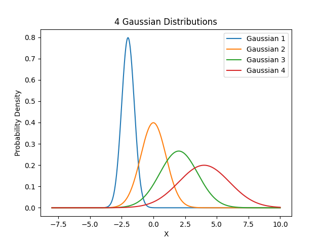

**1.** In a room, there are 200 people.
- 30 of them like only soccer
- 100 of them like only basketball
- 70 of them like both soccer and basketball

What is the probability of a randomly selected person likes basketball **given that** they like soccer?
- [ ] (A)

$$\frac{3}{7}$$
- [x] (B)

$$\frac{7}{10}$$
- [ ] (C)

$$\frac{7}{20}$$
- [ ] (D)

$$\frac{1}{2}$$

**2.** Consider the following experiment:

You roll a dice. If the result is less than 4 (excluding 4), you roll two dice and sum the results. If the result is greater than 4, you roll only one dice and use the result.

What is the probability of getting a final result of 6 after this experiment?
- [x] (A)

$$\frac{11}{72}$$
- [ ] (B)

$$\frac{5}{32}$$
- [ ] (C)

$$\frac{1}{6}$$
- [ ] (D)

$$\frac{5}{72}$$

**3.** Suppose there is a disease that affects 1% of the population. Researchers developed a diagnostic test for this disease. The test has a sensitivity of 95% (meaning it correctly identifies 95% of people with the disease) and a specificity of 90% (meaning it correctly identifies 90% of people without the disease). If a person tests positive for the disease, what is the probability that they actually have the disease, according to Bayes Theorem?
- [ ] $90$%
- [ ] $15.58$%
- [x] $8.76$%
- [ ] $42.76$%

**4.** Consider the following experiment:

You flip a coin 10 times. 

What is the probability of getting at least 2 heads? 

Hint: You can use the Binomial Distribution to model this experiment. Also, in this case, it might be easier to use the complement rule
$P \left( X \ge 2 \right) = 1 - P \left( X \lt 2\right) = 1 - \left( P \left( X = 0 \right) + P \left( X = 1 \right) \right)$.
- [ ] (A)

$$\frac{2^{10} - 1}{2^{10}}$$
- [ ] (B)

$$\frac{2^{10} - 10}{2^{10}}$$
- [ ] (C)

$$\frac{1}{2^{10}}$$
- [x] (D)

$$\frac{2^{10} - 11}{2^{10}}$$

**5.** Suppose a random variable $X$ is such that $X \thicksim Uniform \left( 0, 1 \right)$.

The value for $P \left( X \le \frac{1}{2} \right)$ is:
- [ ] (A)

$$\frac{1}{3}$$
- [ ] (B)

$$1$$
- [ ] (C)

$$0$$
- [x] (D)

$$\frac{1}{2}$$

**6.**

About the 4 Gaussians in the graph above, it is correct to say (check all that apply).
- [ ] (A)

$$\sigma_{Gaussian1} \gt \sigma_{Gaussian2}$$
- [x] (B)

$$\sigma_{Gaussian3} \gt \sigma_{Gaussian2}$$
- [ ] (C)

$$\mu_{Gaussian1} \gt \mu_{Gaussian2}$$
- [x] (D)

$$\sigma_{Gaussian4} \gt \sigma_{Gaussian1}$$
- [x] (E)

$$\mu_{Gaussian4} \gt \mu_{Gaussian3}$$

**7.** You roll a dice 20 times and count how many times the number 4 appears.

If X is the number of times the number 4 appears, then $X \thicksim Binomial \left( n, p \right)$, where $n$ and $p$ are: 
- [ ] (A)

$$n = \frac{1}{2}, p = 4$$
- [x] (B)

$$n = 20, p = \frac{1}{6}$$
- [ ] (C)

$$n = \frac{1}{6}, p = 20$$
- [ ] (D)

$$n = 4, p = \frac{1}{2}$$

**8.** You have to work with the following random variable: the height of people in a country. What is the best distribution to model this random variable from the options below?
- [ ] Binomial Distribution
- [ ] Uniform Distribution
- [x] Normal Distribution
