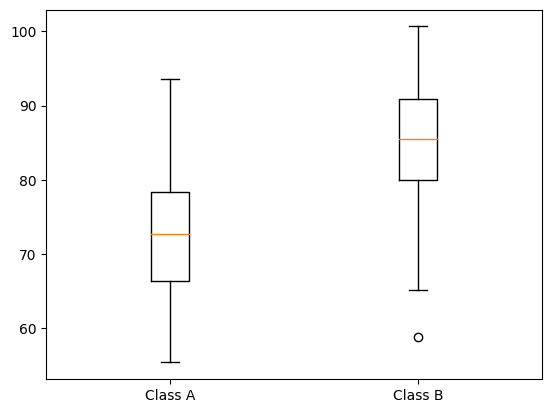

**1.**

$$\begin{matrix} \hline \text{Set} & | & \text{Values} \cr \hline 1 & | & 1 & 5 & 7 & 9 \cr 2 & | & -20 & -10 & 0 & 10 \cr 3 & | & 100 & 101 & 102 & 103 \cr 4 & | & -10 & -5 & 0 & -5 \cr \hline \end{matrix}$$

Consider the four sets of samples above. Which one has the smallest **variance?**
- [ ] $1$
- [ ] $2$
- [x] $3$
- [ ] $4$

**2.** About the **mean, mode** and **median,** it is correct to say (check all that apply).
- [ ] The mean is always greater than or equal to the median.
- [x] The median is more stable to outliers than the mean.
- [x] The mode is the most frequent value in a sample.
- [x] There can be more than one mode ins a sample.

**3.** Consider the following **independent** random variables:

$$X \thicksim \text{Normal} \left( 3, 1^{2} \right)$$
$$Y \thicksim \text{Normal} \left( 2, 2^{2} \right)$$

Then $Z = X + Y \thicksim \text{Normal} \left( \mu, \sigma^{2} \right)$, where $\mu$, $\sigma$ are equal to:
- [ ] $\mu = \sqrt{5}, \sigma = \sqrt{3}$
- [x] $\mu = 5, \sigma = \sqrt{5}$
- [ ] $\mu = 5, \sigma = \sqrt{3}$
- [ ] $\mu = 5, \sigma = 5$

**4.** What is the advantage of looking at the standard deviation instead of the variance?
- [ ] The standard deviation is less affected by outliers than the variance.
- [x] The standard deviation has the same dimension as the sample.
- [ ] The standard deviation may be negative.
- [ ] There are no advantages. They mean the same thing.

**5.** Which of the following best describes the purpose of a QQ plot?
- [ ] To visualize the distribution of a dataset
- [ ] To visualize the relationship between two datasets
- [x] To test for normality of a dataset
- [ ] To test for independence between two datasets

**6.** Which of the following is true about a box plot with a long whisker on the upper end?
- [ ] The data is negatively skewed
- [x] The data is positively skewed
- [ ] The data is normally distributed
- [ ] There are no outliers

**7.** Which of the following is a correct statement regarding a QQ plot?
- [ ] If the points fall close to the diagonal, the data is not normally distributed
- [x] If the points fall close to the diagonal line, the data is normally distributed
- [ ] If the points fall far from the diagonal line, the data is normally distributed
- [x] If the points fall far from the diagonal line, the data is not normally distributed

**8.** Consider the following box plot for the test scores of two classes, A and B:

Which of the following statements is true?
- [ ] The median score of Class A is higher than the median score of Class B.
- [x] The median score of Class B is higher than the median score of Class A.
- [x] The interquartile range of Class A is larger than the interquartile range of Class B.
- [ ] The interquartile range of Class B is larger than the interquartile range of Class A.

**9.** Consider the following QQ plot for a set of data:

Which of the following statements is true?
- [x] The data looks normally distributed.
- [ ] The data is not normally distributed.
- [ ] The data has a higher variance than a normal distribution.
- [ ] The data has a lower variance than a normal distribution.
