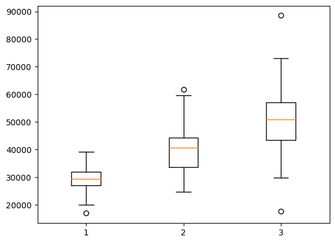
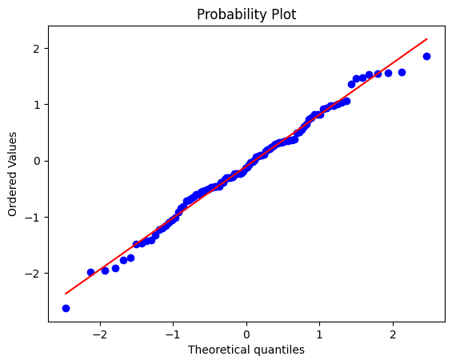
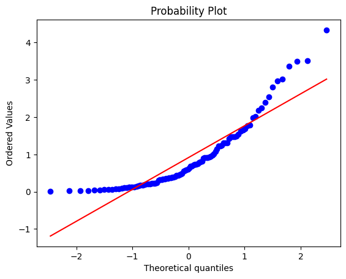
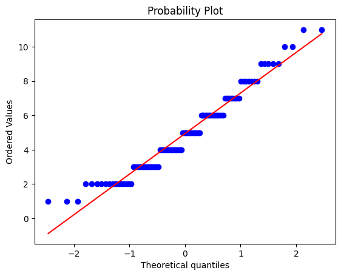
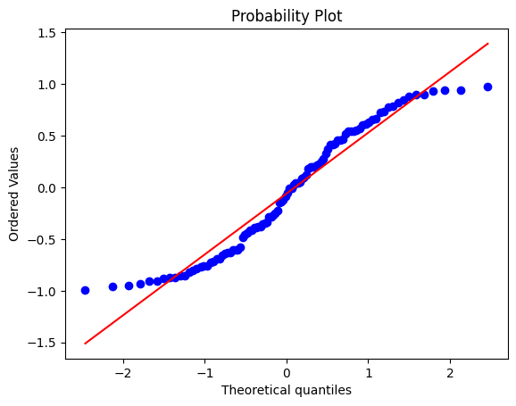

**1.** What is the expected value of rolling a fair six-sided dice?
- [ ] $1$
- [x] $3.5$
- [ ] $3$
- [ ] $6$

**2.** If we roll two fair six-sided dice, what is the probability that the sum of the dice is greater than or equal to 9?
- [ ] $1/9$
- [ ] $1/6$
- [x] $5/18$
- [ ] $1/3$

**3.** The box plot bellow shows the distribution of salaries for employees in three different departments of a company. Interpret the box plot and select all that apply.

- [x] The median salary of department 2 is higher than the median salary of department 1.
- [ ] The IQR of department 3 is smaller than department 1.
- [ ] There are no outliers in depertment 2.
- [x] The range of salaries in department 3 is larger than the range of salaries in depertment 2.

**4. Which of the following QQ plots represents a set of data that is more likely normally distributed?**

- [x] (A)

- [ ] (B)

- [ ] (C)

- [ ] (D)

**5.** A fair six-sided dice is rolled. What is the expected value of the square of the number rolled?

- [ ] (A)

$$\frac{7}{6}$$
- [ ] (B)

$$\frac{35}{36}$$
- [x] (C)

$$\frac{91}{6}$$
- [ ] (D)

$$\frac{49}{36}$$

**6.** Suppose that the joint probability distribution of two random variables X and Y is given by the following table:

$$\begin{matrix} \text{X/Y} & | & 1 & 2 & 3 \cr \hline 1 & | & 0.1 & 0.2 & 0.3 \cr 2 & | & 0.2 & 0.1 & 0.1 \end{matrix}$$

What is the probability that X and Y both take even values?
- [ ] $0.2$
- [x] $0.1$
- [ ] $0.3$
- [ ] $0.4$

**7.** About the correlation coeficient, it is correct to say (check all that apply):
- [ ] It is always positive real number.
- [ ] It can be any real number.
- [x] It measures how linearly correlated two variables are.
- [x] It is a real number between -1 and 1.

**8.** Suppose that the joint probability distribution of two random variables X and Y is given by the following table:

$$\begin{matrix} \text{X/Y} & | & 0 & 1 \cr \hline 0 & | & 0.2 & 0.1 \cr 1 & | & 0.1 & 0.6 \end{matrix}$$

What is the covariance between X and Y?
- [ ] $-0.04$
- [x] $0.11$
- [ ] $0.02$
- [ ] $0.04$
